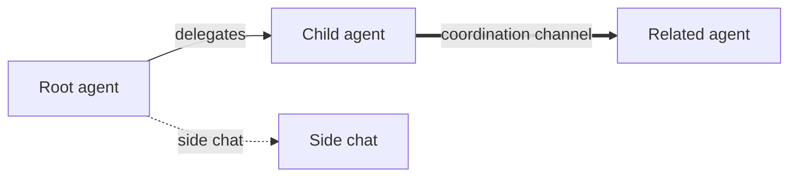

# Harness

Harness is a local fork of [T3 Code](https://github.com/pingdotgg/t3code), an "agent harness control surface" for the agents on your machine.

This fork is pinned to upstream commit `9a49d6d5a656254d7079d463aa6ead5d62f4a3e6`. Harness keeps the upstream MIT license and package internals while using its own desktop identity and data directory.

Works with your subscriptions on Claude Code, Codex, Cursor, Grok Build, OpenCode, and Google Antigravity. If they're set up on your computer, Harness can control them.

## "Wait, what are you selling me?"

Nothing. We built Harness because we wanted the best possible development experience with agents. We were inspired by existing solutions like the Codex desktop app, Conductor, Claude Desktop and Cursor Glass, but none met our bar.

We wanted something performant, remote-ready, and truly open. If we ever go the wrong direction, we want you to have everything you need to fork and build the editor that you want.

## Local development

Install dependencies with `vp i`, then start the web and server surfaces with:

```bash
vp run dev
```

Harness stores standalone and worktree development state under `.harness` (or `~/.harness` outside a worktree). Set `T3CODE_HOME` or pass `--home-dir`/`--base-dir` when you need a different location.

## Agent canvas

The chat landing page is a persistent graph of the threads in the selected environment.



Each node opens the existing full chat surface and shows execution and delivery separately (for example, **Working** plus **In review**). Dragging between nodes creates a durable relationship and coordination channel. Channel state, decisions, revisions, and retryable outbox/inbox deliveries are stored in SQLite; an agent can acknowledge a revision to mark the channel aligned. Convergence is bounded to three rounds so a disagreement becomes visible as an actionable limit instead of an endless agent loop.

The first slice is Codex-first and local: child agents and side chats are durable graph agents backed by Harness thread IDs; a new draft remains in the local draft store until its first turn is sent. The graph service owns relationships and synchronization metadata. Provider adapters and automatic worktree orchestration can be added behind the same graph RPCs.

See [the canvas design](./docs/harness-canvas.md) for the interaction wireframe, persistence model, and next-slice boundaries.

## Installation

> [!WARNING]
> Harness currently supports Codex, Claude, Cursor, Grok Build, OpenCode, and Antigravity. Install and authenticate at least one provider before use:
>
> - Codex: install [Codex CLI](https://developers.openai.com/codex/cli) and run `codex login`
> - Claude: install [Claude Code](https://claude.com/product/claude-code) and run `claude auth login`
> - Cursor: install [Cursor CLI](https://cursor.com/cli) and run `agent login`
> - Grok Build: install [Grok Build CLI](https://x.ai/cli) and run `grok login`
> - OpenCode: install [OpenCode](https://opencode.ai) and run `opencode auth login`
> - Antigravity: enable it in Settings, then use **Install Antigravity** and **Sign in with Google**. No CLI is required.

### Command line

```bash
curl -fsSL https://t3.codes/install.sh | sh
```

On Windows, in PowerShell:

```powershell
irm https://t3.codes/install.ps1 | iex
```

Then run `t3` to start the server and open the local web app. `t3 service install` keeps it running in the background, `t3 update` moves to a newer release, and `t3 --help` has the full reference.

To try it once without installing, run `npx t3@latest` instead.

### Desktop app

Install the latest version of the desktop app from [GitHub Releases](https://github.com/pingdotgg/t3code/releases), or from your favorite package registry:

#### Windows (`winget`)

```bash
winget install T3Tools.T3Code
```

#### macOS (Homebrew)

```bash
brew install --cask t3-code
```

#### Arch Linux (AUR)

Stable:

```bash
yay -S t3code-bin
```

Nightly:

```bash
yay -S t3code-nightly-bin
```

The AUR packaging is maintained in this repository under [`packaging/aur`](./packaging/aur).

## Some notes

We are very very early in this project. Expect bugs.

We are (mostly) not accepting contributions yet. Small fixes may be considered. Big features will not be.

## Documentation

Full docs live in [docs/](./docs). There's no docs site yet.

- [Install and first run](./docs/user/install.md)
- [Permission modes](./docs/user/permission-modes.md)
- [Keyboard shortcuts](./docs/user/keybindings.md)
- [Project settings](./docs/user/project-settings.md)
- [Remote access from a phone or another machine](./docs/user/remote-access.md)
- [Keeping app and server in sync](./docs/user/updating.md)
- [Source control integrations](./docs/user/source-control.md)
- Multiple accounts: [Codex](./docs/user/providers-codex.md) · [Claude](./docs/user/providers-claude.md)
- [Run Harness as a background service](./docs/user/background-service.md)

Building from source? Start at [docs/internals/overview.md](./docs/internals/overview.md).

## If you REALLY want to contribute still.... read this first

### Install `vp`

Harness uses Vite+ so you'll need to install the global `vp` command-line tool.

#### macOS / Linux

```bash
curl -fsSL https://vite.plus | bash
```

#### Windows

```bash
irm https://vite.plus/ps1 | iex
```

Checkout their getting started guide for more information: https://viteplus.dev/guide/

### Install dependencies

```bash
vp i
```

Read [CONTRIBUTING.md](./CONTRIBUTING.md) before reporting a bug or opening a PR.

Have a feature request? Start an [Ideas discussion](https://github.com/pingdotgg/t3code/discussions/categories/ideas).

Need support? Join the [Discord](https://discord.gg/jn4EGJjrvv).
