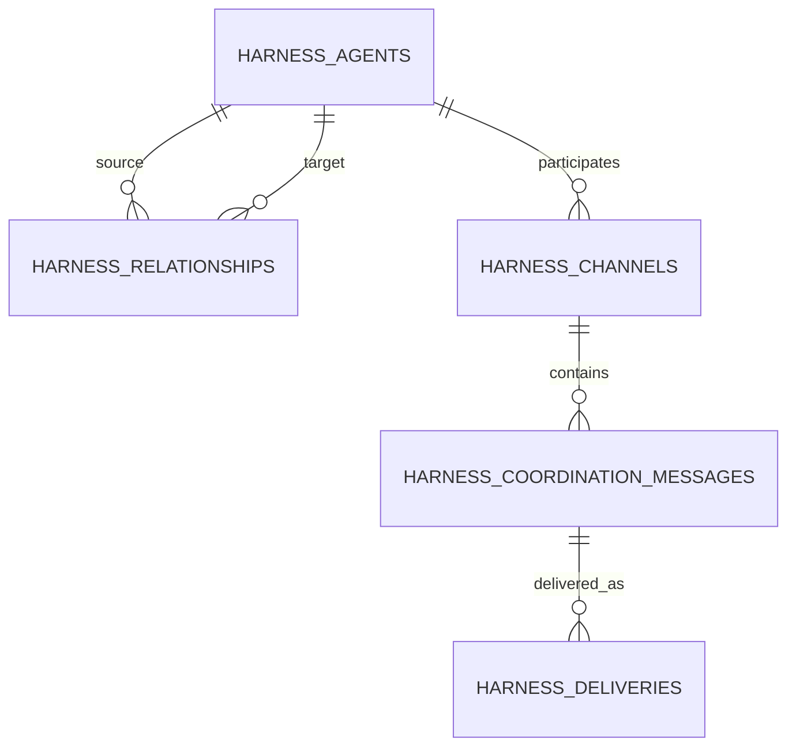

# Harness canvas design

The Harness landing page is a graph view over the existing T3 Code thread
surface. A node is either an agent backed by a T3 thread or a provider-native
child observed inside one; edges describe delegation, side chats, or a
coordination channel.

## Rough layout

```text
┌─────────────────────────────────────────────────────────────────────────────┐
│ Agent canvas   7 agents   Fit view   Expand all   Show archived   New agent │
│ Projects: web 4   api 2   docs 1       Connect agents: [from] → [to]       │
├───────────────────────────────────────────────┬─────────────────────────────┤
│                                               │ Channel: Agent A ↔ Agent B   │
│       ┌──────────────┐       delegates       │ Shared work                  │
│       │ Agent A      │ ──────────────────┐   │ syncing · revision 2         │
│       │ Working      │                   ▼   │ Transcript                   │
│       │ In review    │             ┌────────┐  │  Agent A  test result...     │
│       └──────────────┘             │Agent B │  │  Agent B  acknowledged...    │
│              ╲ coordinates         │Blocked│  │ Shared decisions             │
│               ╲                    └────────┘  │ [Send coordination update]  │
│                ┌──────────────┐                 │ Sync · Pause · Disconnect  │
│                │ Side chat    │                 └─────────────────────────────┘
│                │ Idle         │
│                └──────────────┘
└─────────────────────────────────────────────────────────────────────────────┘
```

## Interaction rules

- Click a T3-backed node to open its normal full chat. Draft nodes reopen the
  draft composer; provider-native nodes open their parent thread's Agents panel
  for inspection because they do not have an independent T3 thread.
- Drag from a node handle, or use the connection selector, to create a
  relationship and a `Shared work` coordination channel.
- Dragging a node saves its canvas position. Collapsing a node hides delegation
  descendants while leaving connected peers visible.
- Each node shows two independent badges: execution (`Working`, `Blocked`,
  `Waiting`, and so on) and delivery (`PR open`, `In review`, `Merged`).
- Selecting a coordination edge opens the channel drawer. The drawer reads the
  durable transcript, exposes decisions and revisions, and sends user updates
  through the outbox.

## Persistence model



Graph state lives in the host SQLite database. A graph revision invalidates
live subscriptions, while channel messages and delivery attempts remain
durable across reconnects. Acknowledgements compare each participant's view
against the other participant's revision stream; convergence is capped at
three rounds.

## Next slice

The current slice owns the graph protocol, local Harness thread creation, and
provider-native lifecycle projection. Native nodes are inspect-only and retain
their provider identity instead of pretending to be T3 threads. Provider-
specific control or fork adapters, automatic outbox workers, and worktree-aware
agent execution can plug into the existing channel and delivery tables without
changing the canvas contract.
